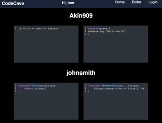

# Code-Cave

A React/Redux JS app which attempts to build on the functionality of Github's gists by not only providing a place where code can be saved but also providing a better tooled online editor i.e. with syntax highlighting themes and a REPL so that code can be evalutated as it is being written.

## Tech Stack
* React/Redux
* React-Apollo
* GraphQL
* Styled Components V2
* PostgresQL
* Jest for testing [WIP]

## Run Locally
* `git clone` the repository
* `cd client && yarn install`
* `cd ../server/ && yarn install`
* Setup Local Database
  * Set up local database - if you have pg installed run `createdb code_cave`
  * If you do not have pg installed here is [link](https://www.moncefbelyamani.com/how-to-install-postgresql-on-a-mac-with-homebrew-and-lunchy/) on how to get setup
  * Then run yarn build:db
* From the `client` directory `yarn run both:dev`

## Todo
- [ ] Improve form validation
- [ ] Improve test coverage
- [x] Add click to edit saved code functionality
- [ ] Implement REPL
- [ ] Add Moar configuration options
- [ ] Allow snippets to be imported
